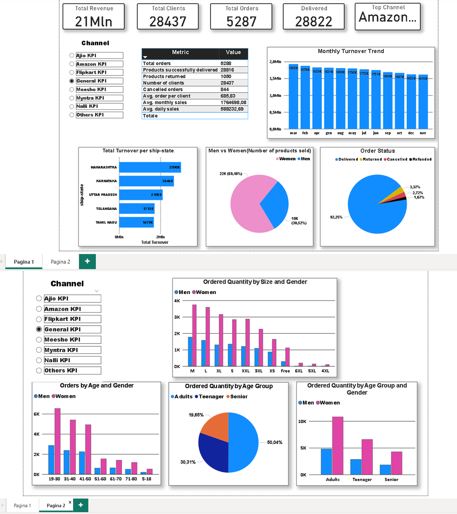

 # Virinda Store Data Analysis Project
 ### This project show a complete data analysis workflow on sales data from the "Vrinda Store" in 2022.The goal is to extract meaningful business insights by calculating general key performance indicators (KPIs), store sales channels key performance indicators, performing descriptive and statistical analyses, visualizing the results through interactive dashboards and interactive python plots. The analysis is performed using Python (Pandas,Numpy, Matplotlib, Seaborn) for data cleaning, transformation, KPI calculation and data visualization. The results are then visualized and explored interactively in a Power BI dashboard, allowing users to filter and drill down into the data by sales channel, age group, gender, city, and more.

## 📦 Dataset
### The dataset used for this analysis was downloaded from Kaggle and refers to the sales of an online clothing store called VAStra Store.The dataset contains orders of clothes of different categories and size, sold on various online platforms (such as Amazon, Myntra and Ajio).Dataset can be retrieved from **resources\Vrinda Store Data Analysis.xlsx** then open the file in excel and navigate to the sheet **VAStra Store**.

## 🧰 Tools Used:
- **Microsoft Excel:** Tables, Tables Pivot, Plots and dashboard.

- **Python-Pandas,Numpy,Matplotlib,Plotply:** for loading data, data cleaning, data analysis and data visualization.

- **Power BI:** for data and key performance indicators dinamic visualization.

## 🎯 Business Objectives
Vrinda Store wants to create an annual sales report for 2022 to better understand their customers and enhance sales in the future.

1. **General Key Performance Indicators:**
    
     - Total Orders: **5288**.

     - Average Monthly Sales: average monthly turnover of the entire store is **1764698.08 ₹(INR)**.

     - Average Daily Sales: average daily turnover of the entire store is **588232.69 ₹(INR)**.

     - Orders delivered: number of orders having Status "Delivered" is **28816**.

     - Orders returned: number of orders having Status "Returned" is **1050**.

     - Orders cancelled: number of orders having Status "Cancelled" is **844**.

     - Number of Clients: total number of unique clients of the store is **28437**.

     - Average order per client: average order value of the clients is **685.83 ₹(INR)**.

     - Peak Sales Month: month having the highest peak in sales is **2022-03**, the turnover is **1928066**.

     - Number of bike sold by size: This pandas Series contains the total number of product sales divided by "size".

     - Sales by gender Men: total number of products and the total turnover obtained by sales to Gender "Men" is **Qty-9535,  Amount-7613604 ₹(INR)**.

     - Sales by gender Women: total number of products and the total turnover obtained by sales to Gender "Women" is **Qty-21702,  Amount-13562773 ₹(INR)**.

     - Most fluent city: city with the most shipments made is **Bengaluru**.

     -Most fluent state: state with the most shipments made is: **Maharashtra**.

     - The channel with the highest number of orders is **Amazon**.

2. **Store's sales channels Key Performance Indicators:**
     - Total Revenue: total turnover for the year 2022.

     - Total Number of Orders: total number of orders for the year 2022.

     - Average Order Value.

     - Delivered Orders: total number of orders having Status "Delivered".

     -  Returned Orders: total number of orders having Status "Returned".

     - Cancelled Orders: total number of orders having Status "Cancelled".

     - Orders Delivered Rate.

     - Orders Returned Rate.

     - Women Orders: total number of orders made by Gender "Women.

     - Men Orders: total number of orders made by Gender "Men".

     - Men Orders Percentage: percentage of orders made by Gender "Men" compared to total orders.

     - Women Orders Percentage: percentage of orders made by Gender "Women" compared to total orders.

     - Teenagers Orders: total number of orders made by Age Group "Teenagers".

     - Teenagers Orders percentage: percentage of orders made by Age Group "Teenagers" compared to total orders.

     - Adults Orders: total number of orders made by Age Group "Adults".

     - Adults Orders percentage: percentage of orders made by Age Group "Adults" compared to total orders.

     - Senior Orders: total number of orders made by Age Group "Senior".

     - Senior Orders percentage: percentage of orders made by Age Group "Senior" compared to total orders.

## 🔍 Key Insights:
-  **March** was the month with the highest peak in sales for a total turnover of **1928066 ₹(INR)**, sales increased 2.8% from February to March.

- After March the sales trend gradually decreased, **September** was the month with the least sales.

- The average monthly turnover is always more than **1.6 million ₹(INR)** throughout the year.

- There is a moderate positive correlation (**0.172**) between quantity ordered and total amount.

 

- Women's wear generated the highest revenue across all categories with a total turnover of **13562773 ₹(INR)**.

- People from 31 to 40 years old(**Age Group: "Adults"**) placed the most orders **(7795)**

- Top 5 cities with the highest number of orders: **Bengaluru,  Hyderabad, New Delhi, Chennai, Mumbai.**

- Top 5 states that generated the highest turnover: **Maharashtra, Karnataka, Uttar Pradesh, Telangana, Tamil Nadu.**

## 📈 **Data Visualization and Dashboard**

### 📊 Plots Generated:
All the plots generated during the analysis are available in the `plots/` folder:

- **Distribution Plots:**
  - `distribution_age.png` - Age distribution analysis
  - `distribution_gender.png` - Gender distribution analysis  
  - `distribution_ship_city.png` - Ship city distribution
  - `distribution_ship_state.png` - Ship state distribution
  - `distribution_status.png` - Order status distribution

- **Sales Analysis Plots:**
  - `monthly_average_sales.png` - Monthly average sales trend
  - `monthly_average_sales_corrected.png` - Corrected monthly sales analysis

### 📱 Power BI Dashboard:
An interactive Power BI dashboard has been created to visualize all KPIs and insights dynamically.

   

#### Access the Dashboard:
- **Local File**: `plots/dashboard.pbix` (requires Power BI Desktop)

- **Power BI Service**: https://app.powerbi.com/links/V_OoVnBekL?ctid=9df08a7c-31d7-4024-9ba6-5ed5efac1a01&pbi_source=linkShare&bookmarkGuid=d84bbe71-bd0c-44d4-ae9f-03278cf29107

